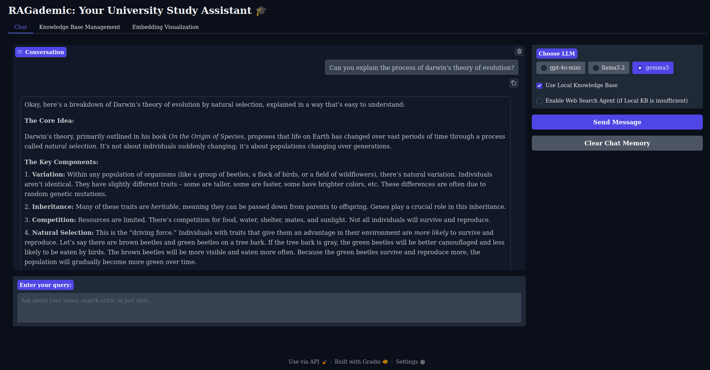
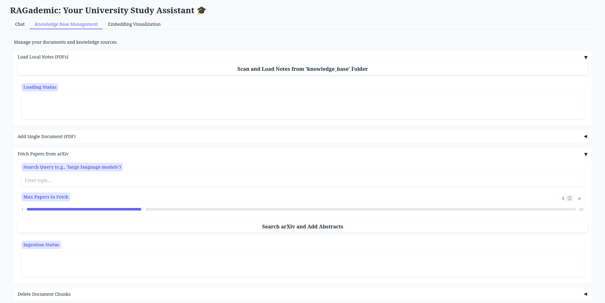

# RAGademic: Query Your University Notes and Books!

This project provides a **Retrieval-Augmented Generation (RAG)** system to query your university notes and books efficiently (could be used to retrieve any kind of document really, but this is the use case i've opted for! :) ). It allows users to upload PDF documents, store them in a **Chroma** vector database, and interact with them through an LLM-powered chatbot. The project also includes a visualization tool for document embeddings.

## Features
- **Chat with your notes**: Ask questions, and the system retrieves relevant information using embeddings.
- **Database management**: Upload, delete, and visualize document embeddings.
- **Arxiv source addition**: Search for papers on specific topics and add them to your knowledge base.
- **Three LLM options**: Use either OpenAI's API or local models like **LLaMA3.2** and the new **Gemma3** via ollama chat.
- **Three Embedding options**: Use either OpenAI's embedder, HF embedder from the hub or chroma builtin local embedder.
- **Persistent memory**: Keeps track of conversations in between sessions, using llama3.2 as a summarizer to keep context windows occupation optmized.
- **Web Search Agent**: If activated, it evalutaes (using local llama3.2) the pertinence of the local knowledge wrt the query of the user and if necessary it scrapes the web for more context.

---

## Installation

### Prerequisites
- Ensure you have Python **3.8+** installed.
- Install [Ollama](https://ollama.com/) to run local models.
### 1. Clone the Repository
```bash
git clone https://github.com/yourusername/ragademic.git
cd ragademic
```
### 2. Create Env end install requirements
```bash
python3 -m venv ragademic
pip install -r requirements.txt
```
Also create .env file and add:
```bash
OPENAI_API_KEY=<your_key>
EMBEDDER_TYPE=<type> 
HF_TOKEN=<your_token> 
MODEL_SIZE=<number_of_params>
```
Notes: 
- you can use llama3.2 installing it locally with ollama.
- the openai api key is needed if you use gpt for chatting and/or openai embeddings.
- embedder_type can be **huggingface** or **openai** or **local** which uses chroma built in vectorizer.
- the huggingface embedding is obtained through API but it could be done locally too.
- when using Gemma3, provide the size of the model you pulled.

### 3. Load your PDF
Load PDFs 
```bash
./knowledge_base
    /category_1/*.pdf
    ...
    /category_n/*.pdf
```

### 4. Run the app
```bash
python3 app.py
```
#### Chat Interface

#### DB Management Interface

#### Embeddings Visualization

### Author: 
<div align="center">
    <p>Gianmarco Russo</p>
    <a href="https://www.linkedin.com/in/grusso98/" style="text-decoration:none;">
      </a>
  </div> 